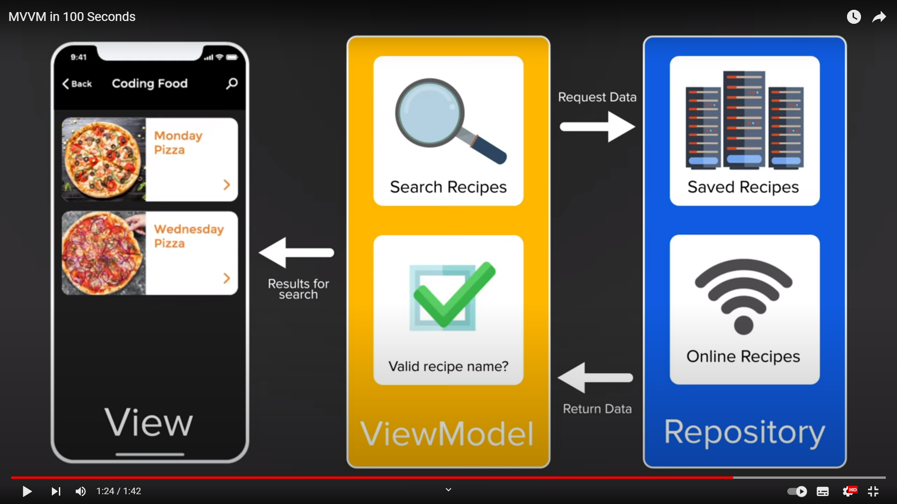

# MVVM

MODEL VIEW VIEW-MODEL

## Seperation of constants.

- UI
- Business Logic
- Data Source

- Also includes the BINDER which is XAML

Allows us to easily read and test software

## What is a model?

Data source.
A repository that collects all the data that might be available.
The model

## What is a ViewModel?

The view model is what updates UX components and does thinks like

- validating login
- searching and filtering
- uses user input

## What is a view model

Contains UI elements
Gets updated events from the view model to update what is seen by the user
no business logic

Wrapper Over Model which is easily readable/bindable by View using minimum Effort/Code.

IDataErrorInfo - Should go into ViewModel
INotifyPropertyChanged - Should go into ViewModel. Could also go in the Model if necessary (But not recommended)
Public Properties - Yes of course a Model should have them.

## Starting a project

1. Select new wpf app
2. Create a folder for Models, View, Viewmodels.
3. Inside the Moels Folder create a class for each model in the tree. 
4. If something such as RoomId needs calculating create a class for that as well