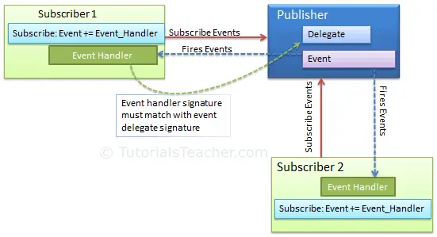

# Event handlers

## What are events?

They enable a class or object to notify other classes or objects that an event occured

Eventsare following the 'Observer design pattern' [Link_Here](https://learn.microsoft.com/en-us/dotnet/standard/events/observer-design-pattern)

Publisher - sends event - determines when raised
Subscriber - handles event - determines what happens

Based on the .Net event deligate

1. create a class i.e Button
2. create a method called OnClick()
3. Create a new EventHandler and name it
4. In the onclick function 'ClickEventName.Invoke(this, EventArgs.Empty)
5. Create a new Button button
6. button.ClickEventName += (source, args) => { code }

